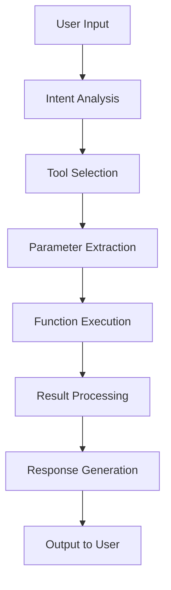

# Advanced Function Calling & Tool Integration Guide

*Last Updated: December 6, 2025*

## Table of Contents

1. [Introduction to Function Calling](#introduction-to-function-calling)
2. [Function Definition Best Practices](#function-definition-best-practices)
3. [RAG Integration Techniques](#rag-integration-techniques)
4. [Multi-Tool Orchestration](#multi-tool-orchestration)
5. [Error Handling & Resilience](#error-handling--resilience)
6. [Security Considerations](#security-considerations)
7. [Performance Optimization](#performance-optimization)
8. [Platform-Specific Implementations](#platform-specific-implementations)
9. [Advanced Patterns](#advanced-patterns)
10. [Troubleshooting Guide](#troubleshooting-guide)

## Introduction to Function Calling

Function calling enables AI models to interact with external systems, APIs, and tools to extend their capabilities beyond text generation. Modern implementations support:

- **Tool Selection**: Automatic selection of appropriate tools for tasks
- **Parameter Extraction**: Intelligent parsing of user inputs to function parameters
- **Result Integration**: Seamless incorporation of tool outputs into responses
- **Chain Execution**: Sequential tool usage for complex workflows

### Core Components



### Function Calling vs Traditional Approaches

| Aspect | Traditional Prompting | Function Calling |
|--------|----------------------|------------------|
| **Data Access** | Static knowledge only | Real-time external data |
| **Computation** | Text-based estimation | Precise calculations |
| **Actions** | Descriptive only | Actual system operations |
| **Accuracy** | Knowledge cutoff limited | Current information |
| **Capabilities** | Language model only | Extended through tools |

## Function Definition Best Practices

### Comprehensive Function Schema

```json
{
  "name": "analyze_financial_data",
  "description": "Analyzes financial data and generates insights including trends, ratios, and forecasts",
  "parameters": {
    "type": "object",
    "properties": {
      "data_source": {
        "type": "string",
        "description": "Source of financial data (e.g., 'quarterly_reports', 'market_data', 'custom_dataset')",
        "enum": ["quarterly_reports", "market_data", "custom_dataset"]
      },
      "analysis_type": {
        "type": "array",
        "items": {
          "type": "string",
          "enum": ["trend_analysis", "ratio_analysis", "forecasting", "comparative_analysis"]
        },
        "description": "Types of analysis to perform"
      },
      "time_period": {
        "type": "object",
        "properties": {
          "start_date": {
            "type": "string",
            "format": "date",
            "description": "Start date in YYYY-MM-DD format"
          },
          "end_date": {
            "type": "string", 
            "format": "date",
            "description": "End date in YYYY-MM-DD format"
          }
        },
        "required": ["start_date", "end_date"]
      },
      "metrics": {
        "type": "array",
        "items": {"type": "string"},
        "description": "Specific financial metrics to analyze (e.g., 'revenue', 'profit_margin', 'debt_ratio')"
      },
      "output_format": {
        "type": "string",
        "enum": ["summary", "detailed", "visualization"],
        "default": "summary",
        "description": "Level of detail in the analysis output"
      }
    },
    "required": ["data_source", "analysis_type", "time_period"]
  },
  "returns": {
    "type": "object",
    "description": "Financial analysis results with insights and recommendations"
  }
}
```

### Schema Design Principles

#### 1. Clear, Descriptive Names
```json
// ❌ Poor naming
{"name": "proc_data", "description": "processes stuff"}

// ✅ Good naming  
{"name": "process_customer_transactions", "description": "Processes and validates customer transaction data for fraud detection analysis"}
```

#### 2. Detailed Parameter Descriptions
```json
{
  "credit_score": {
    "type": "integer",
    "minimum": 300,
    "maximum": 850,
    "description": "FICO credit score ranging from 300-850, where higher scores indicate better creditworthiness"
  }
}
```

#### 3. Input Validation
```json
{
  "email": {
    "type": "string",
    "pattern": "^[a-zA-Z0-9._%+-]+@[a-zA-Z0-9.-]+\\.[a-zA-Z]{2,}$",
    "description": "Valid email address format"
  },
  "phone": {
    "type": "string", 
    "pattern": "^\\+?[1-9]\\d{1,14}$",
    "description": "International phone number format with optional + prefix"
  }
}
```

#### 4. Default Values and Optional Parameters
```json
{
  "pagination": {
    "type": "object",
    "properties": {
      "page_size": {
        "type": "integer",
        "default": 20,
        "minimum": 1,
        "maximum": 100,
        "description": "Number of items per page"
      },
      "page_number": {
        "type": "integer",
        "default": 1,
        "minimum": 1,
        "description": "Page number to retrieve"
      }
    }
  }
}
```

### Function Categories

#### Data Retrieval Functions
```json
{
  "name": "search_knowledge_base",
  "description": "Searches internal knowledge base for relevant information",
  "parameters": {
    "type": "object",
    "properties": {
      "query": {
        "type": "string",
        "description": "Search query with support for boolean operators and phrases"
      },
      "filters": {
        "type": "object",
        "properties": {
          "category": {"type": "string"},
          "date_range": {"type": "object"},
          "relevance_threshold": {"type": "number", "minimum": 0, "maximum": 1}
        }
      }
    },
    "required": ["query"]
  }
}
```

#### Action Functions
```json
{
  "name": "send_notification",
  "description": "Sends notifications through various channels with retry logic",
  "parameters": {
    "type": "object",
    "properties": {
      "recipients": {
        "type": "array",
        "items": {"type": "string"},
        "description": "List of recipient identifiers (emails, phone numbers, or user IDs)"
      },
      "message": {
        "type": "object",
        "properties": {
          "subject": {"type": "string"},
          "body": {"type": "string"},
          "priority": {"type": "string", "enum": ["low", "normal", "high", "urgent"]}
        },
        "required": ["body"]
      },
      "channels": {
        "type": "array",
        "items": {"type": "string", "enum": ["email", "sms", "push", "slack"]},
        "description": "Communication channels to use"
      }
    },
    "required": ["recipients", "message", "channels"]
  }
}
```

#### Computation Functions
```json
{
  "name": "calculate_advanced_metrics",
  "description": "Performs complex mathematical calculations and statistical analysis",
  "parameters": {
    "type": "object",
    "properties": {
      "operation": {
        "type": "string",
        "enum": ["regression", "correlation", "optimization", "statistical_test", "monte_carlo"],
        "description": "Type of calculation to perform"
      },
      "data": {
        "type": "array",
        "items": {"type": "number"},
        "description": "Numerical data for calculations"
      },
      "parameters": {
        "type": "object",
        "description": "Operation-specific parameters",
        "additionalProperties": true
      }
    },
    "required": ["operation", "data"]
  }
}
```

## RAG Integration Techniques

### RAG Architecture Patterns

#### Vector Search RAG
```json
{
  "name": "vector_search_rag",
  "description": "Performs semantic search using vector embeddings and retrieves relevant context",
  "parameters": {
    "type": "object",
    "properties": {
      "query": {
        "type": "string",
        "description": "User query for semantic search"
      },
      "embedding_model": {
        "type": "string",
        "enum": ["text-embedding-ada-002", "text-embedding-3-small", "text-embedding-3-large"],
        "default": "text-embedding-3-small"
      },
      "similarity_threshold": {
        "type": "number",
        "minimum": 0,
        "maximum": 1,
        "default": 0.7,
        "description": "Minimum cosine similarity for relevant results"
      },
      "max_results": {
        "type": "integer",
        "minimum": 1,
        "maximum": 50,
        "default": 10
      },
      "metadata_filters": {
        "type": "object",
        "description": "Filters to apply based on document metadata"
      }
    },
    "required": ["query"]
  }
}
```

#### Hybrid Search RAG
```json
{
  "name": "hybrid_search_rag", 
  "description": "Combines keyword and semantic search for optimal retrieval",
  "parameters": {
    "type": "object",
    "properties": {
      "query": {"type": "string"},
      "search_weights": {
        "type": "object",
        "properties": {
          "semantic_weight": {"type": "number", "minimum": 0, "maximum": 1},
          "keyword_weight": {"type": "number", "minimum": 0, "maximum": 1}
        },
        "description": "Relative weights for semantic vs keyword search"
      },
      "rerank_strategy": {
        "type": "string",
        "enum": ["relevance", "diversity", "temporal", "authority"],
        "description": "Method for reranking combined results"
      }
    },
    "required": ["query"]
  }
}
```

### RAG Prompt Integration

#### Basic RAG Template
```
System: You are an AI assistant with access to a knowledge base. Use the retrieved context to provide accurate, well-sourced answers.

Available Functions:
- search_knowledge_base(query, filters)
- get_document_details(document_id)

User Query: {user_query}

Instructions:
1. Search the knowledge base for relevant information
2. Analyze retrieved context for relevance and accuracy
3. Synthesize information into a comprehensive response
4. Cite specific sources with document IDs
5. Indicate confidence level in your answer
6. Flag any gaps in available information

Response Format:
- Main Answer: [comprehensive response]
- Sources: [list of document IDs and relevance]
- Confidence: [high/medium/low]
- Limitations: [any gaps or uncertainties]
```

#### Advanced RAG with Multi-Step Reasoning
```
System: You are a research assistant capable of multi-step information gathering and analysis.

Available Tools:
- search_knowledge_base(query, filters)
- get_related_documents(document_id, relationship_type)
- analyze_document_sentiment(document_id)
- extract_entities(text, entity_types)
- validate_information(claim, sources)

User Query: {complex_research_question}

Research Process:
1. Break down the query into research components
2. Search for primary sources for each component
3. Identify and retrieve related/supporting documents
4. Cross-validate information across multiple sources
5. Analyze any conflicting information
6. Synthesize findings with confidence assessments

Output Structure:
- Executive Summary: [key findings]
- Detailed Analysis: [component-by-component breakdown]
- Source Evaluation: [reliability and bias assessment]
- Confidence Assessment: [certainty levels for each claim]
- Further Research: [identified gaps and next steps]
```

## Multi-Tool Orchestration

### Sequential Tool Usage

```
System: You are a business analyst with access to multiple data sources and analysis tools.

Available Tools:
- fetch_market_data(symbol, period, metrics)
- analyze_financial_trends(data, analysis_type)
- compare_competitors(company_list, metrics)
- generate_forecast(historical_data, model_type)
- create_visualization(data, chart_type)

User Request: "Analyze Apple's stock performance and create a comprehensive investment report"

Workflow:
1. Fetch Apple's stock data for the past 2 years
2. Analyze trends in price, volume, and volatility
3. Compare Apple to key competitors (Microsoft, Google, Amazon)
4. Generate 6-month forecast using multiple models
5. Create visualizations for all key findings
6. Synthesize into investment recommendation

Execute this workflow and provide a comprehensive report.
```

### Parallel Tool Execution

```
System: You are a customer service analyzer with real-time data access.

Available Tools:
- get_customer_profile(customer_id)
- fetch_transaction_history(customer_id, period)
- check_support_tickets(customer_id, status)
- analyze_sentiment(text)
- get_product_info(product_id)

User Request: "Analyze customer ID 12345's recent experience and satisfaction"

Parallel Analysis Strategy:
Execute these tools simultaneously:
- Tool 1: Customer profile and demographics
- Tool 2: Transaction history (last 90 days)
- Tool 3: Support ticket analysis
- Tool 4: Sentiment analysis of recent communications

Synthesis:
Combine all results to create a comprehensive customer experience assessment with actionable insights and recommendations.
```

### Conditional Tool Logic

```
System: You are an intelligent agent capable of adaptive tool usage based on context.

Available Tools:
- search_internal_docs(query)
- search_web(query, filters)
- analyze_code(repository, file_path)
- run_tests(test_suite, environment)
- generate_documentation(code_base, format)

Decision Logic:
IF query is about internal processes:
  → Use search_internal_docs first
  → If insufficient results, escalate to search_web
  
IF query involves code analysis:
  → Use analyze_code for specific files
  → Run relevant tests to validate understanding
  → Generate updated documentation if needed

IF query requires external information:
  → Use search_web with appropriate filters
  → Cross-reference with internal docs for policy compliance

Apply this logic to: {user_query}
```

## Error Handling & Resilience

### Graceful Error Handling

```
System: You are equipped with error handling capabilities for robust tool usage.

Error Handling Strategy:
1. Retry Logic: Automatically retry failed operations up to 3 times with exponential backoff
2. Fallback Options: Use alternative tools when primary tools fail
3. Partial Success: Continue with available data when some tools fail
4. User Communication: Clearly explain limitations and attempted solutions

Example Error Scenarios:

API Timeout:
"I attempted to fetch the latest market data but encountered a timeout. I've initiated a retry and will use cached data from 15 minutes ago to provide preliminary analysis while waiting for current data."

Invalid Parameters:
"The date range you specified appears to be invalid. I'll use the closest valid range (2023-01-01 to 2024-12-01) and note this adjustment in my analysis."

Service Unavailable:
"The primary data source is currently unavailable. I'll use our secondary data provider and flag any potential differences in data quality or coverage."

Tool Selection:
- Primary: {preferred_tool}
- Fallback: {alternative_tool}
- Emergency: {manual_process_description}
```

### Validation and Verification

```json
{
  "name": "validate_tool_output",
  "description": "Validates and verifies tool outputs for accuracy and consistency",
  "parameters": {
    "type": "object",
    "properties": {
      "output_data": {
        "type": "object",
        "description": "Tool output to validate"
      },
      "validation_rules": {
        "type": "array",
        "items": {
          "type": "object",
          "properties": {
            "rule_type": {"type": "string", "enum": ["range_check", "format_validation", "consistency_check", "business_logic"]},
            "parameters": {"type": "object"}
          }
        }
      },
      "cross_reference_sources": {
        "type": "array",
        "items": {"type": "string"},
        "description": "Additional sources for validation"
      }
    },
    "required": ["output_data", "validation_rules"]
  }
}
```

### Monitoring and Logging

```
System: Implement comprehensive monitoring for tool usage and performance.

Logging Strategy:
1. Function Calls: Log all tool invocations with parameters
2. Response Times: Track tool performance metrics
3. Error Rates: Monitor failure patterns
4. Usage Patterns: Analyze tool selection efficiency

Monitoring Template:
```
[TIMESTAMP] TOOL_CALL: {tool_name}
Parameters: {sanitized_parameters}
Execution_Time: {duration_ms}ms
Status: {success/failure/partial}
Response_Size: {bytes}
Error_Details: {error_message_if_any}
User_Context: {session_id}
```

Performance Alerts:
- Response time > 5 seconds
- Error rate > 5% in 10-minute window  
- Consecutive failures from same tool
- Unusual parameter patterns
```

## Security Considerations

### Input Sanitization

```json
{
  "name": "secure_database_query",
  "description": "Executes database queries with comprehensive security controls",
  "parameters": {
    "type": "object",
    "properties": {
      "query_template": {
        "type": "string",
        "description": "Parameterized query template with placeholders"
      },
      "parameters": {
        "type": "object",
        "description": "Query parameters (will be sanitized)"
      },
      "access_level": {
        "type": "string",
        "enum": ["read_only", "read_write", "admin"],
        "description": "Required access level for query execution"
      },
      "data_classification": {
        "type": "string",
        "enum": ["public", "internal", "confidential", "restricted"],
        "description": "Classification level of data being accessed"
      }
    },
    "required": ["query_template", "parameters", "access_level"]
  },
  "security_controls": {
    "input_validation": "All parameters validated against whitelist patterns",
    "sql_injection_prevention": "Parameterized queries only, no dynamic SQL",
    "access_control": "Role-based access verification before execution",
    "audit_logging": "All queries logged with user context"
  }
}
```

### Authentication and Authorization

```
System: All tool usage must respect authentication and authorization controls.

Security Framework:
1. User Authentication: Verify user identity before tool access
2. Role-Based Access: Enforce tool permissions based on user roles
3. Data Classification: Respect data sensitivity levels
4. Audit Trail: Log all tool usage for security review

Permission Matrix:
```
Tool Category    | Guest | User | Admin | Super Admin
Data Retrieval   |   ✓   |   ✓  |   ✓   |     ✓
Data Analysis    |   ✗   |   ✓  |   ✓   |     ✓
Data Modification|   ✗   |   ✗  |   ✓   |     ✓
System Admin     |   ✗   |   ✗  |   ✗   |     ✓
```

Security Validation:
Before each tool call:
1. Verify user session is valid and not expired
2. Check user has required permissions for tool and data
3. Validate request parameters for malicious content
4. Apply data masking/filtering based on access level
```

### Data Privacy Protection

```json
{
  "name": "privacy_aware_data_processing",
  "description": "Processes data with privacy protection and compliance controls",
  "parameters": {
    "type": "object",
    "properties": {
      "data_source": {"type": "string"},
      "processing_purpose": {
        "type": "string",
        "enum": ["analytics", "reporting", "machine_learning", "user_service"]
      },
      "privacy_level": {
        "type": "string", 
        "enum": ["anonymous", "pseudonymous", "identifiable"],
        "description": "Privacy level of data being processed"
      },
      "consent_verification": {
        "type": "boolean",
        "description": "Whether user consent has been verified for this purpose"
      },
      "retention_policy": {
        "type": "string",
        "description": "Data retention requirements (e.g., '30_days', '1_year', 'indefinite')"
      }
    },
    "required": ["data_source", "processing_purpose", "privacy_level"]
  },
  "privacy_controls": {
    "data_minimization": "Only process data necessary for stated purpose",
    "anonymization": "Apply anonymization techniques when possible",
    "encryption": "Encrypt data in transit and at rest",
    "access_logging": "Log all data access for audit purposes",
    "retention_enforcement": "Automatically delete data per retention policy"
  }
}
```

## Performance Optimization

### Caching Strategies

```json
{
  "name": "intelligent_cache_manager",
  "description": "Manages caching for improved tool performance",
  "parameters": {
    "type": "object",
    "properties": {
      "cache_key": {"type": "string"},
      "cache_strategy": {
        "type": "string",
        "enum": ["lru", "ttl", "adaptive", "write_through"],
        "description": "Caching strategy to employ"
      },
      "ttl_seconds": {
        "type": "integer",
        "minimum": 60,
        "maximum": 86400,
        "description": "Time-to-live for cached data"
      },
      "invalidation_triggers": {
        "type": "array",
        "items": {"type": "string"},
        "description": "Events that should invalidate the cache"
      }
    },
    "required": ["cache_key", "cache_strategy"]
  }
}
```

### Batch Processing

```
System: Optimize tool usage through intelligent batching.

Batch Processing Strategy:
1. Request Aggregation: Combine similar requests into batches
2. Priority Queuing: Process high-priority requests first  
3. Load Balancing: Distribute requests across available resources
4. Result Streaming: Return partial results while processing continues

Example Batch Prompt:
"I need to analyze multiple data sets. Instead of processing each individually, batch these operations:
- Analyze Q1 2024 sales data
- Analyze Q2 2024 sales data  
- Analyze Q3 2024 sales data
- Compare all quarters and identify trends

Batch these analyses for efficiency while maintaining result quality."

Batching Rules:
- Maximum batch size: 10 operations
- Timeout per batch: 30 seconds
- Failure handling: Isolate failed operations, continue with successful ones
- Result formatting: Clearly separate results for each batched operation
```

### Asynchronous Processing

```json
{
  "name": "async_task_manager",
  "description": "Manages asynchronous tool execution for long-running operations",
  "parameters": {
    "type": "object",
    "properties": {
      "task_id": {"type": "string"},
      "operation": {"type": "string"},
      "parameters": {"type": "object"},
      "priority": {
        "type": "string",
        "enum": ["low", "normal", "high", "urgent"],
        "default": "normal"
      },
      "callback_url": {
        "type": "string",
        "format": "uri",
        "description": "Webhook URL for completion notification"
      },
      "max_execution_time": {
        "type": "integer",
        "description": "Maximum execution time in seconds"
      }
    },
    "required": ["task_id", "operation", "parameters"]
  }
}
```

## Platform-Specific Implementations

### OpenAI Function Calling

```python
# OpenAI API Function Calling Example
import openai

tools = [
    {
        "type": "function",
        "function": {
            "name": "get_weather",
            "description": "Get current weather for a location",
            "parameters": {
                "type": "object",
                "properties": {
                    "location": {
                        "type": "string",
                        "description": "City and state, e.g. San Francisco, CA"
                    },
                    "unit": {
                        "type": "string", 
                        "enum": ["celsius", "fahrenheit"],
                        "description": "Temperature unit"
                    }
                },
                "required": ["location"]
            }
        }
    }
]

response = openai.chat.completions.create(
    model="gpt-4o",
    messages=[
        {"role": "user", "content": "What's the weather in Boston?"}
    ],
    tools=tools,
    tool_choice="auto"
)
```

### Anthropic Claude Tool Use

```python
# Claude Tool Use Example
import anthropic

client = anthropic.Anthropic()

tools = [
    {
        "name": "calculator",
        "description": "Perform mathematical calculations",
        "input_schema": {
            "type": "object",
            "properties": {
                "expression": {
                    "type": "string",
                    "description": "Mathematical expression to evaluate"
                }
            },
            "required": ["expression"]
        }
    }
]

message = client.messages.create(
    model="claude-3-5-sonnet-20241022",
    max_tokens=1024,
    tools=tools,
    messages=[
        {"role": "user", "content": "Calculate 25 * 4 + 10"}
    ]
)
```

### Google Gemini Function Calling

```python
# Gemini Function Calling Example
import google.generativeai as genai

def search_web(query: str) -> str:
    """Search the web for information"""
    # Implementation here
    return f"Search results for: {query}"

model = genai.GenerativeModel(
    'gemini-2.0-flash-exp',
    tools=[search_web]
)

response = model.generate_content(
    "Search for the latest news about artificial intelligence"
)
```

## Advanced Patterns

### Chain-of-Tools Pattern

```
System: Execute complex workflows using sequential tool chains.

Chain Definition:
Tool_1 → Tool_2 → Tool_3 → ... → Tool_N

Example: Customer Service Analysis Chain
1. get_customer_profile(customer_id) → customer_data
2. analyze_sentiment(customer_communications) → sentiment_score  
3. fetch_transaction_history(customer_id) → transaction_data
4. identify_issues(customer_data, sentiment_score, transaction_data) → issue_analysis
5. generate_recommendations(issue_analysis) → action_plan

Chain Execution Rules:
- Each tool receives output from previous tool
- Failed tool breaks the chain (with fallback options)
- Intermediate results are preserved for debugging
- Final output combines insights from entire chain

User Request: "Analyze customer satisfaction for customer #12345"
Execute the customer service analysis chain and provide comprehensive insights.
```

### Parallel Tool Execution Pattern

```
System: Execute multiple tools simultaneously for comprehensive analysis.

Parallel Execution Framework:
```
Parallel_Group_1:
├── Tool_A(input_1)
├── Tool_B(input_2)  
└── Tool_C(input_3)

Parallel_Group_2 (depends on Group_1):
├── Tool_D(output_A, output_B)
└── Tool_E(output_C)

Final_Synthesis:
└── Tool_F(output_D, output_E)
```

Example: Market Analysis
Parallel_Group_1:
- fetch_stock_data(symbol="AAPL")
- get_news_sentiment(company="Apple")
- analyze_competitor_performance(competitors=["MSFT", "GOOGL"])

Parallel_Group_2:
- technical_analysis(stock_data, sentiment_data)
- fundamental_analysis(financial_data, competitor_data)

Synthesis:
- generate_investment_recommendation(technical_analysis, fundamental_analysis)
```

### Conditional Tool Routing

```
System: Implement intelligent tool routing based on context and conditions.

Routing Logic:
```
IF user_query.category == "technical":
    IF user_query.complexity == "high":
        route_to = ["advanced_technical_analysis", "code_review_tools"]
    ELSE:
        route_to = ["basic_technical_tools"]
        
ELIF user_query.category == "business":
    IF user_query.data_required == "real_time":
        route_to = ["live_data_feeds", "real_time_analytics"]
    ELSE:
        route_to = ["historical_data_analysis", "trend_analysis"]
        
ELIF user_query.category == "creative":
    route_to = ["content_generation_tools", "design_assistance"]
    
DEFAULT:
    route_to = ["general_search", "basic_analysis"]
```

Routing Implementation:
1. Analyze user query for category, complexity, and requirements
2. Apply routing logic to select appropriate tools
3. Execute selected tools with optimized parameters
4. Synthesize results based on original query intent

User Query: {user_input}
Apply intelligent routing and execute appropriate tool chain.
```

### Tool Composition Pattern

```
System: Compose complex operations from simpler tool primitives.

Composition Framework:
Base Tools: [search, analyze, calculate, format, validate]
Composed Operations: Combine base tools for specific workflows

Example Compositions:

Research_Report = compose(
    search(query, sources),
    analyze(search_results, framework),
    validate(analysis, fact_check),
    format(validated_analysis, report_template)
)

Data_Pipeline = compose(
    extract(data_source, filters),
    transform(raw_data, rules),
    validate(transformed_data, schema),
    load(validated_data, destination)
)

Customer_Insight = compose(
    collect(customer_data, multiple_sources),
    analyze(collected_data, ml_models),
    score(analysis_results, business_metrics),
    recommend(scores, action_templates)
)

Usage:
Define your desired operation as a composition of base tools, then execute the composed workflow.

User Request: {complex_task}
Decompose into tool primitives and execute composed workflow.
```

## Troubleshooting Guide

### Common Issues and Solutions

#### Function Call Failures

**Issue**: Tool not being called when expected
```
Diagnostic Steps:
1. Check function description clarity
2. Verify parameter schema completeness
3. Test with simplified examples
4. Review error messages for hints

Solution Template:
"I notice the {tool_name} function wasn't called. Let me try a more explicit approach:

Tool: {tool_name}
Parameters: {explicit_parameters}
Expected Output: {description}

If this tool isn't available, I'll use alternative approach: {fallback_method}"
```

**Issue**: Invalid parameter errors
```
Debugging Approach:
1. Validate parameter types and formats
2. Check required vs optional parameters  
3. Verify enum values are valid
4. Test parameter combinations

Example Fix:
"The previous call failed due to invalid date format. Let me correct this:
- Original: '2024-13-45' ❌
- Corrected: '2024-12-06' ✅"
```

#### Performance Issues

**Issue**: Slow tool execution
```
Optimization Strategy:
1. Implement caching for repeated calls
2. Use batch processing for multiple similar operations
3. Optimize parameter selection
4. Implement parallel execution where possible

Example:
"I notice the data retrieval is taking longer than expected. I'll:
1. Cache common queries for faster subsequent access
2. Batch related requests together
3. Use more specific filters to reduce data volume"
```

**Issue**: Tool timeout errors
```
Resilience Strategy:
1. Implement retry logic with exponential backoff
2. Break large requests into smaller chunks
3. Use asynchronous processing for long operations
4. Provide partial results when possible

Example:
"The analysis timed out due to large dataset. I'll:
1. Process data in smaller chunks
2. Provide progressive updates
3. Use sampling techniques for initial insights"
```

#### Integration Problems

**Issue**: Tool results inconsistency
```
Validation Approach:
1. Cross-reference results with multiple sources
2. Implement consistency checks
3. Use confidence scoring
4. Flag anomalies for review

Example:
"I'm detecting inconsistent results between data sources:
- Source A: {result_a}
- Source B: {result_b}
- Confidence Assessment: {analysis}
- Recommended Action: {suggestion}"
```

### Error Recovery Patterns

#### Graceful Degradation
```
System: When primary tools fail, gracefully degrade to alternative approaches.

Degradation Hierarchy:
1. Primary Tool: {preferred_tool}
2. Secondary Tool: {backup_tool}
3. Manual Process: {human_process}
4. Cached Data: {previous_results}

Example:
"Primary real-time data source is unavailable. I'm switching to:
- Cached data from 15 minutes ago
- Static analysis methods
- Clear notation of data limitations"
```

#### Partial Success Handling
```
System: When some tools succeed and others fail, provide partial results with clear limitations.

Partial Success Template:
"I was able to complete {successful_operations} but encountered issues with {failed_operations}.

Available Results:
- {result_1}: ✅ Complete
- {result_2}: ⚠️ Partial (limited data)
- {result_3}: ❌ Failed (service unavailable)

Analysis based on available data:
{analysis_with_limitations}

Limitations and Next Steps:
{clear_explanation_of_gaps}"
```

---

Function calling and tool integration represent the cutting edge of AI capability expansion. By following these advanced patterns and best practices, you can create sophisticated AI systems that seamlessly blend language understanding with real-world actions and data access.

*This guide should be adapted to your specific platform and use cases. Regular updates are recommended as new tools and capabilities become available.*